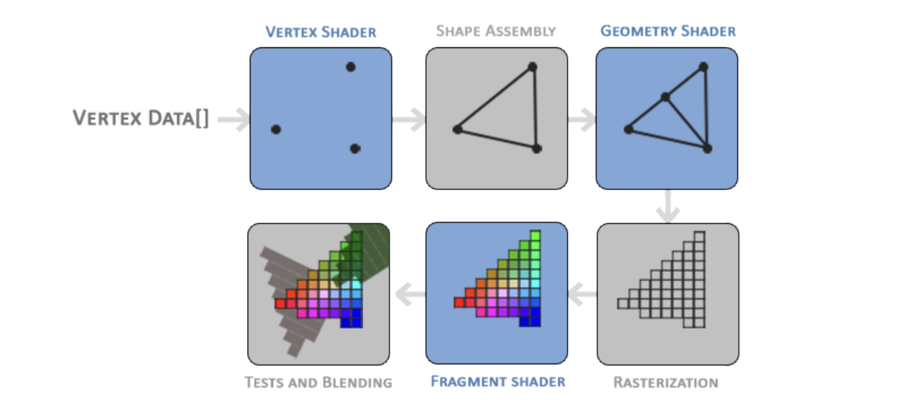
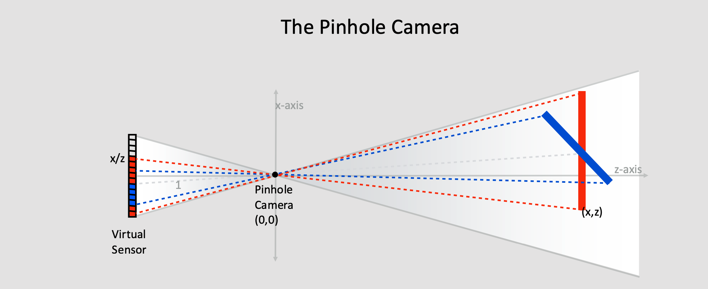
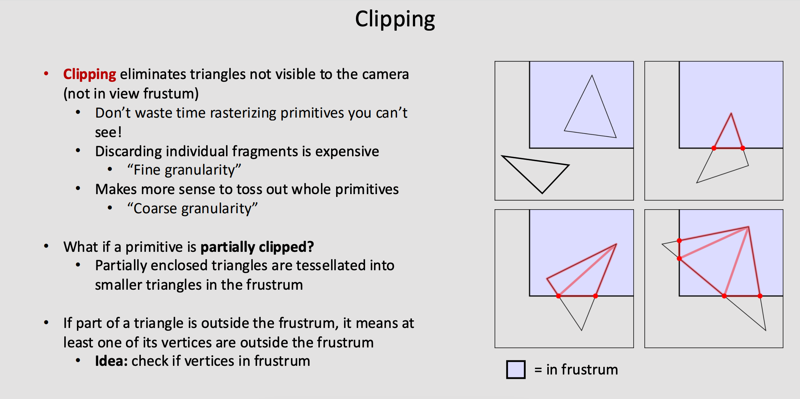
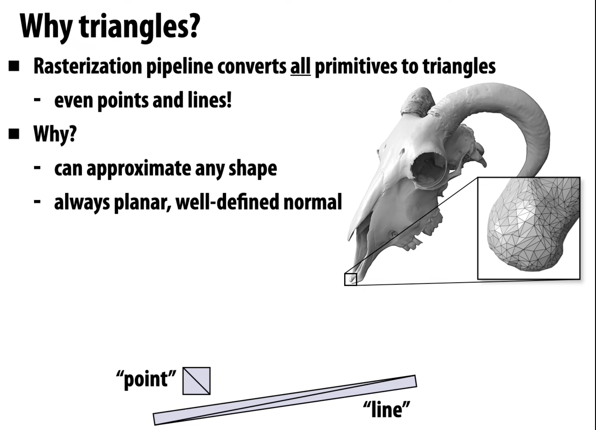
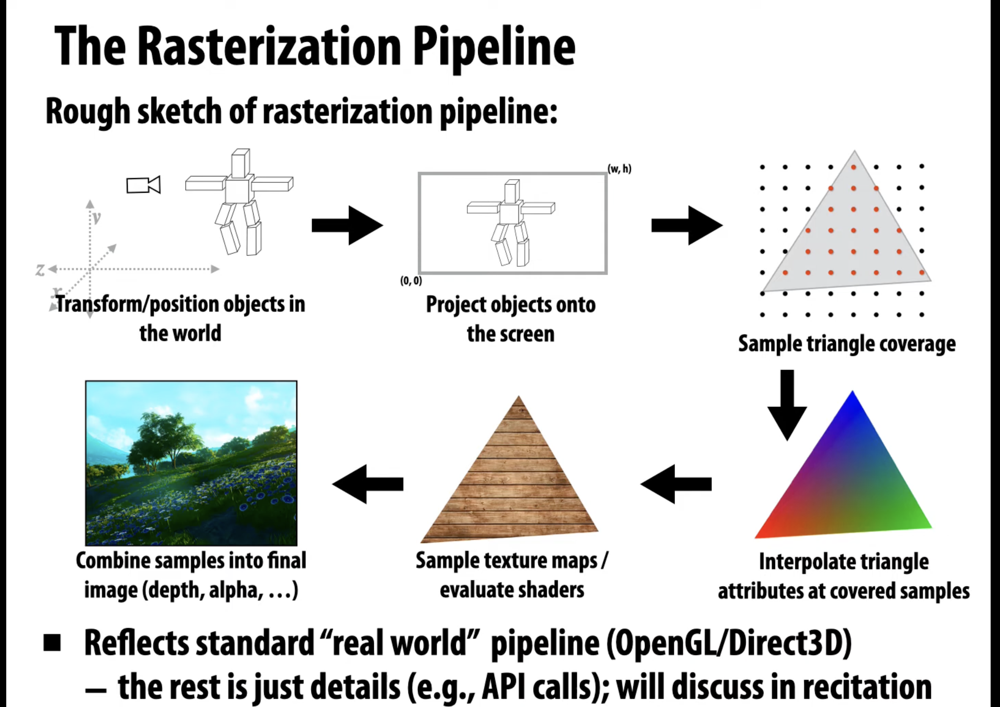
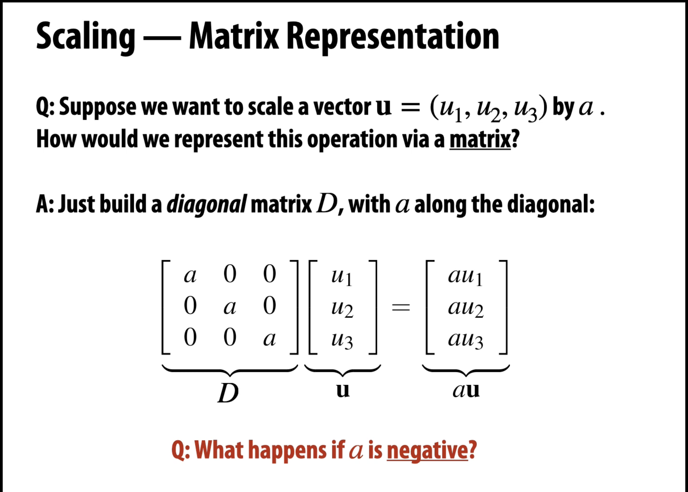
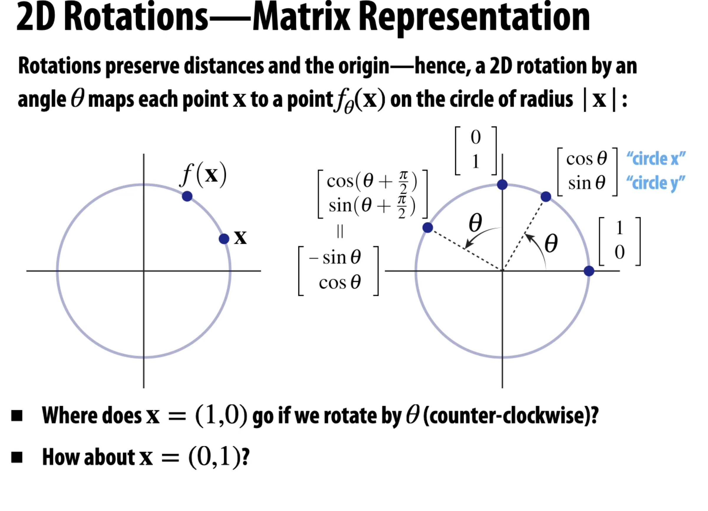
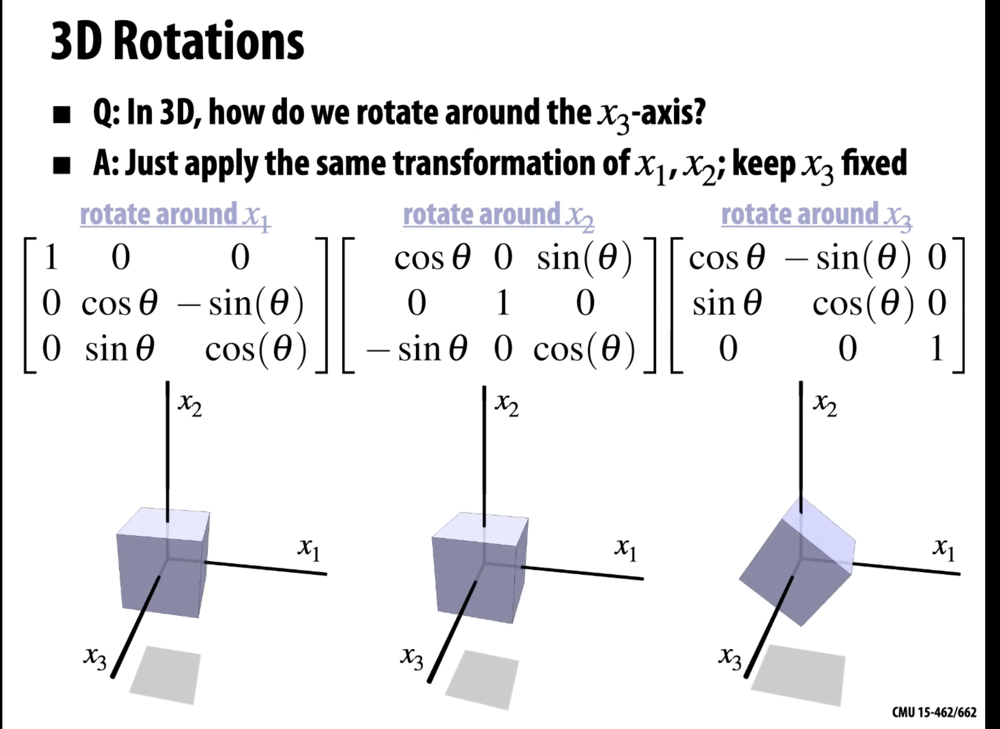
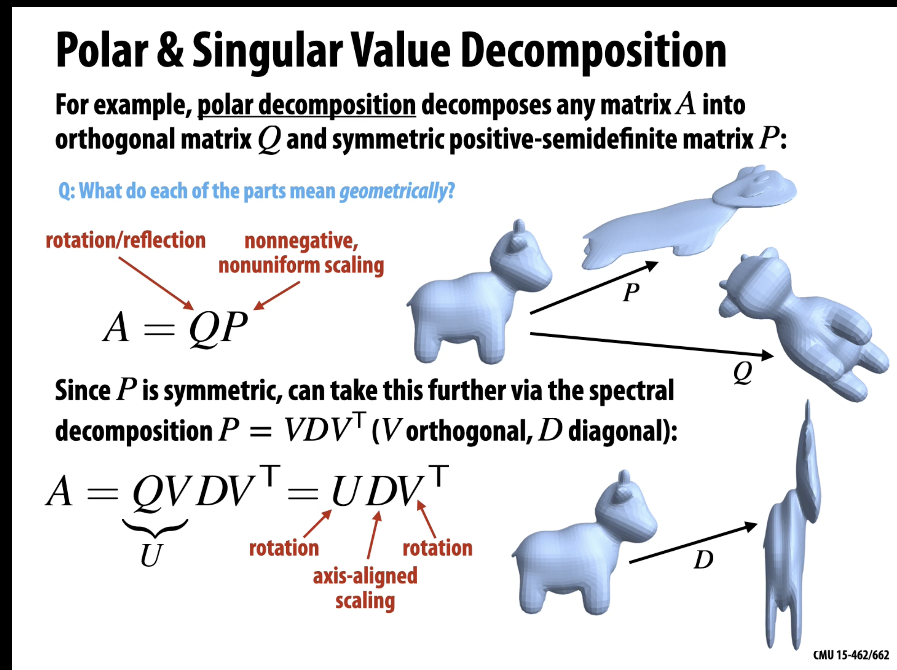

# Project Notes

## How to build and link GLFW from source on MAC OS
Even if you clone this repository with the GLFW header files and the static library `glfw3.a`, there is a chance that these will not work with your system. To compile these from source and link them on your MAC, follow these teps:
Before following these steps, make sure to install `cmake` by running `brew install cmake`.

1. Clone the repository by running `git clone https://github.com/glfw/glfw.git`
cmd+Shift+B to build.
2. Navigate into the cloned folder by running `cd glfw``
3. Create a directory where the build artifacts will go by running `mkdir build``
4. Navigate into the build folder `cd build``
5. Run `cmake .. -DBUILD_SHARED_LIBS=OFF`to configures the project to build static libraries by generating necessary build files (e.g., Makefile).
6. Run `make -j4`to compiles the code into binaries using 4 cores/threads based on the generated Makefile
7. In the cloned glfw project, open the "include" folder  and copy the subfolder "GLFW" into `dependencies/include`
8. There should now be a file names `glfw3.a`under `glfw/build/src`; copy that file and paste into your project directory `dependencies/libs/`
9. Once you complete the above steps, run `cmd+Shift+P`to bring up the vs code command palette. Search for Cmake and click `Cmake: configure`. Your project must be ready to be run at this point

For ease of running, do not forget to install the following vs code extensions: `CMake Tools`. There should now be a play symbol button at the bottom left of vs code that can be clicked to run the project

If encountering issues building, consider deleting `CMakeCache.txt`and redo step **9** above.

## Diagram of the Graphics Pipeline

## New Concepts

- **Rasterization**:  
  Rasterization is the process of converting vector graphics (which use mathematical equations to represent images) into a raster image (a grid of pixels). This is essential for displaying images on screens, as it transforms shapes and colors into a format that can be rendered by your display device.

- **Shaders**:  
  Shaders are small programs that run on the GPU (Graphics Processing Unit) to control the rendering of graphics. They allow developers to define how objects appear on the screen by manipulating pixels and vertices. There are different types of shaders, including vertex shaders and fragment shaders, each serving a specific purpose in the graphics pipeline.

- **Double Buffer**:  
  Double buffering is a technique used to reduce flickering and tearing in graphics rendering. It involves using two buffers: one for displaying the current frame (the front buffer) and another for preparing the next frame (the back buffer). When the next frame is ready, the buffers are swapped, ensuring a smooth visual experience.

- **Primitives**:  
  Primitives are the basic building blocks of 3D graphics. They typically include simple shapes such as points, lines, and triangles. These shapes can be combined and manipulated to create more complex objects in a scene.

- **Vertex**:  
  A vertex is a point in 3D space that defines the corners of a primitive shape. Each vertex has properties like position, color, texture coordinates, and normal vectors, which are used to determine how the vertex interacts with light and texture in the scene.

- **Vertex Shader**:  
  A vertex shader is a type of shader that processes each vertex's data before it is rasterized. It takes input data (such as vertex positions and attributes), applies transformations (like rotation and scaling), and outputs the final vertex position and any additional data needed for the next stage of rendering.

- **Fragment**:
  A fragment in OpenGL is all the data required for OpenGL to render a single pixel

- **Vertex Buffer Objects (VBO)**:
  Vertex Buffer Objects (VBOs) are OpenGL objects that store vertex data in the GPU’s memory for efficient rendering. They allow developers to send large amounts of vertex data (like positions, colors, and texture coordinates) to the GPU in a single call, reducing the overhead of multiple draw calls. VBOs improve performance by minimizing data transfer between the CPU and GPU, making it easier to render complex 3D scenes smoothly.

## **perspective Projection**
In 3D graphics, perspective projection is the process of simulating how objects appear smaller as they get farther from the viewer, just like in real life. This effect is what makes a 3D scene appear realistic on a 2D screen, giving a sense of depth and distance.
- **Distant Objects Appear Smaller**: Objects farther from the camera appear smaller, similar to how our eyes perceive distance.
- **Parallel Lines Converge**: In perspective projection, parallel lines appear to meet at a point on the horizon (vanishing point), giving depth to 3D images.
- **The Pinehoe Camera Model**: Imagine a pinhole camera with a small hole at one side, where light passes through and projects an upside-down image on the opposite wall. In graphics, the camera maps points in the 3D world onto a 2D “virtual sensor.” This mapping involves dividing by the z-coordinate to adjust for depth, where points farther away shrink proportionally.

## **Rasterization Pipeline**
  - **Input**: 3D primitives - essentially all triangles possibly with some addtional attributes such as color, normals and texture coordinates. Rasterization pipeline concerts all primitives to triangles, even lines and points are converted into triangles.
  
  - **Output**: Bitmap image possibly with depth alphas etc
  - **Why triangles?**: Because they can approximate any shape

  1. **Transform/Position Objects in the World**: 
  The first step is to position objects in 3D space relative to a virtual camera. This includes translating, rotating, and scaling objects in relation to a world coordinate system. It uses transformations to place the object correctly within the scene, which is critical for achieving the desired perspective and spatial relationships between objects.

  2. **Project Objects onto the Screen**: Once objects are positioned in 3D space, they are projected onto a 2D screen. This stage involves using a perspective or orthographic projection, converting 3D coordinates to 2D screen space. Perspective projection simulates how objects appear smaller as they get farther from the viewer, creating depth perception.

  3. **Sample Triangle Coverage**: In this stage, the rasterizer determines which pixels on the screen are covered by each primitive (typically triangles) by sampling the triangle's area. The image shows a triangle with a grid of sample points, some of which fall within the triangle. This process is known as fragment generation and determines which parts of the triangle are visible on the screen.

  4. **Interpolate Triangle Attributes at Covered Samples**: Each fragment (or sample point within a triangle) needs properties like color, depth, and texture coordinates to be computed. This stage interpolates these attributes based on the values at the triangle’s vertices. For example, if each vertex of the triangle has a color, the colors across the triangle are smoothly interpolated, creating gradients or shading effects.

  5. **Sample Texture Maps / Evaluate Shaders**:  At this stage, the pipeline evaluates shaders and samples textures. The fragment shader calculates the final color of each fragment, possibly using texture maps (images mapped onto the surface) and applying lighting models. Shaders can create effects like lighting, shadows, and textures to make the object appear realistic.

  6. **Combine Samples into Final Image**:The last step is combining all fragments into a final 2D image. This includes performing depth tests (to determine which fragments are in front) and blending (combining colors for effects like transparency). The result is an image with properly layered and blended fragments, with depth and transparency handled according to the scene's setup. 

  
## Rasterization Pipeline: FAQ
#### Q: Why do 3D models initially need to be transformed into 2D for rendering?

A: The main reason is that screens are 2D surfaces that can only display two-dimensional images. When we render a 3D model, we need to “flatten” it into a 2D representation so that it can be displayed on a monitor or screen. This process is called projection and is necessary because human eyes perceive 3D depth based on the 2D projection on our retinas. The 3D-to-2D projection stage of the rasterization pipeline simulates depth and perspective by adjusting the size and position of objects based on their distance from the virtual camera.

## Q: Why is it necessary to position, scale, and rotate the model in the initial transformation stage?

A: Models are often created in a local coordinate system where the object's position, size, and orientation are set relative to itself, not the overall scene. Before projecting the object onto a screen, we need to:

Position (Translate): Place the model in the correct spot within the 3D world (scene) relative to other objects and the camera.
Scale: Adjust the model's size to fit the intended scene. Models may initially be created at a different scale (e.g., a chair might be modeled very small or very large). Scaling ensures that each object has the correct relative size.
Rotate: Set the correct orientation of the object in the world. This allows for flexibility in positioning, such as tilting a plane's wings or rotating a character to face the camera.
These transformations (positioning, scaling, and rotating) are all part of the model transformation stage, which prepares the object for accurate representation in the world scene, ensuring it looks natural and correctly positioned from the camera's point of view.

## Q: Why can’t we directly project the 3D model onto 2D without transforming it first?

A: Without transformations, models would appear at arbitrary positions, scales, and orientations that don’t match the intended scene. For example, a model created with a local origin (0,0,0) could end up at the screen's center, possibly overlapping with other objects or appearing in an unintended orientation. Transforming the model positions it accurately within the scene, aligning it with other elements, and ensuring proper perspective and scale before projecting it to 2D.

## Sampling and Supersampling in Computer Graphics
Sampling and supersampling are techniques used in computer graphics to create smooth, high-quality images on a pixel-based display. These techniques address challenges related to converting continuous 3D shapes and colors into discrete pixels.

1. **What is Sampling?**
- **Definition** : Sampling is the process of taking measurements or "samples" of a continuous image or shape at discrete points to represent it digitally.
Purpose: In computer graphics, sampling determines the color and brightness of each pixel based on the parts of the scene it represents.
Challenge: Because screens are made up of individual pixels, they cannot display the fine detail of continuous shapes perfectly, especially along edges. This can cause aliasing, where edges look jagged or "stair-stepped."
Example:
Imagine a diagonal line drawn across a grid of pixels. Sampling takes the center of each pixel to determine whether it should be colored based on where the line passes. But if the line falls between pixels, some pixels get only part of the line, leading to an uneven, jagged appearance.

2. **Aliasing and Its Artifacts**
- **Aliasing**: Aliasing is the distortion that occurs when sampling an image at a lower resolution than the scene requires.
- **Artifacts**: This leads to visible artifacts like jagged edges on lines and shapes (often called "jaggies") and unwanted patterns (e.g., moiré patterns).
Solution: To reduce these artifacts, we need more detailed sampling around these problematic areas.

3. **What is Supersampling?**

- **Definition**: Supersampling is an anti-aliasing technique that takes multiple samples within each pixel (A single pixel on a color display is made of several subpixels) and averages them to get a smoother color representation. Instead of just one sample (e.g., the pixel center), multiple samples are taken at various points in the pixel.
-  **Concept of Sub-Pixel Sampling**
  Imagine each pixel on the screen represents a tiny "window" into the scene.
  Instead of taking just one color sample (usually at the center of the pixel), supersampling takes multiple samples at various points within that pixel’s area.
  For example, a 4x4 supersampling pattern divides the pixel into a virtual 4x4 grid, so we get 16 sample points within that pixel’s area. Even though the pixel is discrete, we simulate this finer sampling grid to approximate the different colors or intensities within that pixel.

- **How it Works**:

 For each pixel, supersampling divides it into a grid (e.g., 4x4), taking samples at each sub-point within the pixel. These samples capture finer details and color variations that a single sample would miss.
Averaging: The colors of all the sub-pixel samples are averaged to determine the final color of the pixel. This blending effect smooths out transitions between pixels, especially along edges.
- **Example**:

For a 4x4 supersampling, each pixel is divided into 16 sub-samples, creating a detailed map of the pixel's color variation. If a diagonal line cuts across a pixel, some sub-samples will lie on the line, and others won’t. The average color of the 16 samples will produce a blended effect, making the line look smoother.

4.**Benefits of Supersampling**

Smoother Edges: By blending colors at pixel boundaries, supersampling removes the jagged "stair-step" look, producing smooth transitions and high-quality edges.
Improved Image Quality: Supersampling can handle complex textures and fine details more effectively, reducing visual artifacts and making images look more realistic.
5. Drawbacks of Supersampling
Increased Computation: Supersampling requires many more samples per pixel, which means more calculations. This can significantly impact performance and rendering time, especially in real-time applications like games.
Memory Usage: More samples mean more data, leading to higher memory requirements.
6. Comparison: Regular Sampling vs. Supersampling
Regular Sampling: Takes one sample per pixel, fast but prone to aliasing.
Supersampling: Takes multiple samples per pixel, blending the results to smooth edges, but is more computationally intensive.

7. **Alternatives and Variations to Supersampling**

- **Multisample Anti-Aliasing (MSAA)**: A more efficient version of supersampling that only takes multiple samples at pixel edges, where aliasing is most noticeable.
Post-Processing Anti-Aliasing (e.g., FXAA, SMAA): Techniques applied after rendering to smooth edges without extra sampling, which is faster but may not achieve the same quality as supersampling.
In summary, supersampling improves image quality by taking multiple samples within each pixel to smooth out edges and reduce aliasing. While effective, it requires more processing power and memory. This makes it an essential technique in high-quality rendering, especially when visual fidelity is more critical than processing speed.

## Spatial transformations

- **Linear transformations**:

A linear transformation $( T: V \to W )$ satisfies the properties of additivity and homogeneity. The transformations can be represented with matrices, making them fundamental in various applications, including computer graphics.

### Types of Linear Transformations

1. **Identity Transformation**:
   - **Definition**: Maps every vector to itself.
   - **Example**: $( T(\mathbf{x}) = \mathbf{x} ) \;\; \forall \mathbf{x} \in V$.
   - **Matrix Representation**: The identity matrix $( I )$.
   - **Matrix**:
     $$
     I = \begin{pmatrix}
     1 & 0 & 0 \\
     0 & 1 & 0 \\
     0 & 0 & 1
     \end{pmatrix}
     $$

2. **Zero Transformation**:
   - **Definition**: Maps every vector to the zero vector.
   - **Example**: $T(\mathbf{x}) = \mathbf{0}$.
   - **Matrix Representation**: The zero matrix $(0)$.
   - **Matrix**:
     $$
     0 = \begin{pmatrix}
     0 & 0 & 0 \\
     0 & 0 & 0 \\
     0 & 0 & 0
     \end{pmatrix}
     $$

3. **Scaling Transformation**:
4. 
   - **Definition**: Multiplies every vector by a non-zero scalar $k$.
   - **Example**: $T(\mathbf{x}) = k \mathbf{x}$.
   - **Matrix Representation**: $kI$.
   - **Matrix**:
     $$
     kI = \begin{pmatrix}
     k & 0 & 0 \\
     0 & k & 0 \\
     0 & 0 & k
     \end{pmatrix}
     $$

5. **2D Rotation Transformation**:
6. 
   - **Definition**: Rotates vectors around the origin by an angle $\theta$.
   - **Example**:
   $$
   T(\mathbf{x}) = \begin{pmatrix}
   \cos(\theta) & -\sin(\theta) \\
   \sin(\theta) & \cos(\theta)
   \end{pmatrix} \mathbf{x}
   $$
   - **Matrix**:
   $$
   R = \begin{pmatrix}
   \cos(\theta) & -\sin(\theta) & 0 \\
   \sin(\theta) & \cos(\theta) & 0 \\
   0 & 0 & 1
   \end{pmatrix}
   $$

7. **3D Rotation Transformation**:
8.  
   - **Definition**: Rotates vectors in 3D space around a specified axis (x, y, or z) by an angle $\theta$.
   - **Rotation around the x-axis**:
   $$
   T(\mathbf{x}) = \begin{pmatrix}
   1 & 0 & 0 \\
   0 & \cos(\theta) & -\sin(\theta) \\
   0 & \sin(\theta) & \cos(\theta)
   \end{pmatrix} \mathbf{x}
   $$
   - **Rotation around the y-axis**:
   $$
   T(\mathbf{x}) = \begin{pmatrix}
   \cos(\theta) & 0 & \sin(\theta) \\
   0 & 1 & 0 \\
   -\sin(\theta) & 0 & \cos(\theta)
   \end{pmatrix} \mathbf{x}
   $$
   - **Rotation around the z-axis**:
   $$
   T(\mathbf{x}) = \begin{pmatrix}
   \cos(\theta) & -\sin(\theta) & 0 \\
   \sin(\theta) & \cos(\theta) & 0 \\
   0 & 0 & 1
   \end{pmatrix} \mathbf{x}
   $$

9. **Reflection Transformation**:
   - **Definition**: Reflects vectors across a line (in $\mathbb{R}^2$) or a plane (in $\mathbb{R}^3$).
   - **Example** (reflecting across the x-axis):
   $$
   T(\mathbf{x}) = \begin{pmatrix}
   1 & 0 & 0 \\
   0 & -1 & 0 \\
   0 & 0 & 1
   \end{pmatrix} \mathbf{x}
   $$

10. **Shearing Transformation**:
   - **Definition**: Slants the shape of an object.
   - **Example** (shearing in the x-direction):
   $$
   T(\mathbf{x}) = \begin{pmatrix}
   1 & k & 0 \\
   0 & 1 & 0 \\
   0 & 0 & 1
   \end{pmatrix} \mathbf{x}
   $$
   - **Where $k$ is the shear factor.**

11. **Projection Transformation**:
   - **Definition**: Projects vectors onto a subspace.
   - **Example** (projecting onto the x-y plane):
   $$
   T(\mathbf{x}) = \begin{pmatrix}
   1 & 0 & 0 \\
   0 & 1 & 0 \\
   0 & 0 & 0
   \end{pmatrix} \mathbf{x}
   $$

### Properties of Linear Transformations

1. **Kernel (Null Space)**: The set of vectors that map to the zero vector under the transformation $T$:
   $$
   \text{ker}(T) = \{ \mathbf{x} \in V \mid T(\mathbf{x}) = \mathbf{0} \}
   $$

2. **Image (Range)**: The set of all possible outputs of the transformation $T$:
   $$
   \text{im}(T) = \{ T(\mathbf{x}) \mid \mathbf{x} \in V \}
   $$

3. **Invertibility**: A linear transformation $T$ is invertible if there exists a linear transformation $T^{-1}$ such that:
   $$
   T^{-1}(T(\mathbf{x})) = \mathbf{x} \quad \text{for all } \mathbf{x} \in V
   $$
   This is equivalent to the matrix $A$ being invertible.

### Matrix Decomposition

### Singular Value Decomposition (SVD)

**Definition**: Singular Value Decomposition is a mathematical technique that decomposes a matrix $A$ into three matrices: 

$$
A = U D V^T
$$

Where:
- **$U$** is an $m \times m$ orthogonal matrix whose columns are the left singular vectors, representing the directions in the original space after the final transformation.
- **$D$** is an $m \times n$ diagonal matrix with non-negative real numbers (the singular values) on the diagonal, indicating the scaling factors along the corresponding directions.
- **$V^T$** is the transpose of an $n \times n$ orthogonal matrix whose columns are the right singular vectors, representing the rotation and alignment of the original coordinate system.

### Transformations Applied by Each Component

1. **Right Singular Vectors ($V$)**:
   - **Transformation Applied**: **Rotation/Alignment**
   - **Description**: Rotates and aligns the original coordinate system.

2. **Diagonal Matrix ($D$)**:
   - **Transformation Applied**: **Scaling**
   - **Description**: Scales the transformed coordinates along the directions defined by the left singular vectors.

3. **Left Singular Vectors ($U$)**:
   - **Transformation Applied**: **Final Rotation/Orientation**
   - **Description**: Applies a final rotation and alignment to the output space.

### Transformations by Components of SVD

1. **Right Singular Vectors ($V$)**:
   - **Transformation Applied**: **Rotation/Alignment**
   - **Description**: The matrix $V^T$ rotates and aligns the original coordinate system. Each column of $V$ defines a new basis for the input space, transforming the original points to align with the principal directions of variance in the data.

2. **Diagonal Matrix ($D$)**:
   - **Transformation Applied**: **Scaling**
   - **Description**: The diagonal matrix $D$ scales the transformed coordinates along the directions defined by the left singular vectors. Each diagonal entry represents the magnitude of stretching or compressing along its corresponding axis. Larger values indicate more significant transformations, while smaller values indicate less effect.

3. **Left Singular Vectors ($U$)**:
   - **Transformation Applied**: **Final Rotation/Orientation**
   - **Description**: The matrix $U$ applies a final rotation and alignment to the output space. Each column of $U$ defines how the scaled coordinates are transformed into the final coordinate system. This ensures that the transformed data retains its geometric relationships and orientations.

### Summary of Transformations

- **$V^T$**: **Rotates the original space to align with the principal directions**.
- **$D$**: **Scales the transformed coordinates along these principal directions**.
- **$U$**: **Applies a final rotation to orient the scaled coordinates in the new space**.
